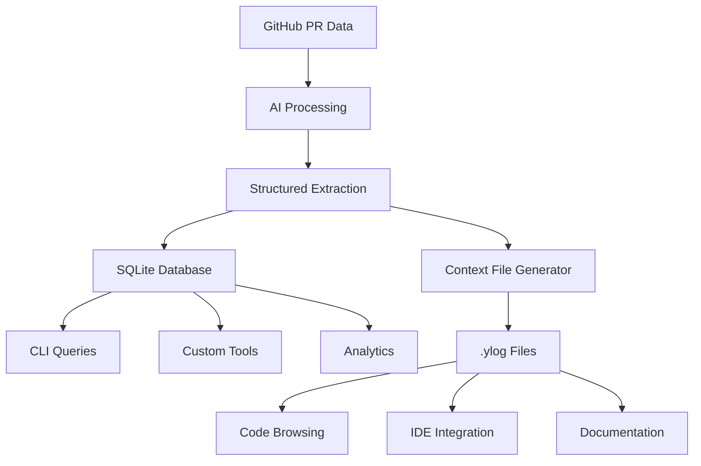

## The Hybrid Approach

ylog uses a unique **hybrid output strategy** that combines the best of both structured data storage and human-readable documentation:

<CardGroup cols={2}>
  <Card title="SQLite Database" icon="database">
    Structured, queryable data for tools and complex analysis
  </Card>
  <Card title="Context Files" icon="file-text">
    Human-readable markdown files placed throughout your codebase
  </Card>
</CardGroup>

This dual approach ensures that both humans and machines can effectively consume your institutional memory.

## Why Not Just One?

<Tabs>
  <Tab title="Database Only">
    **Pros:**
    - Fast queries and filtering
    - Structured data for tooling
    - No repository clutter
    
    **Cons:**
    - Requires tools to access
    - Not discoverable while browsing code
    - Barrier to adoption for casual users
  </Tab>
  <Tab title="Files Only">
    **Pros:**  
    - Immediately visible in codebase
    - Human-readable format
    - Works with any text editor
    
    **Cons:**
    - Hard to query across areas
    - Limited filtering capabilities
    - No structured data for tooling
  </Tab>
  <Tab title="Hybrid (ylog's approach)">
    **Pros:**
    - Best of both worlds
    - Multiple access patterns
    - Tool-friendly AND human-friendly
    
    **Cons:**
    - Slightly more complex
    - Two systems to maintain
  </Tab>
</Tabs>

## SQLite Database Benefits

The database provides powerful querying capabilities:

### Rich Filtering

```bash
# Complex queries made simple
ylog show --author alice --since 2025-01-01 --area src/auth
ylog show --format json | jq '.[] | select(.additions > 100)'
```

### Structured Data Access

```javascript
// Direct SQLite access for custom tools
const Database = require('better-sqlite3');
const db = new Database('.ylog/prs.db');

// Find all PRs that modified authentication
const authPRs = db.prepare(`
  SELECT pr.number, pr.title, pr.author 
  FROM prs pr
  JOIN file_changes fc ON pr.number = fc.pr_number  
  WHERE fc.file_path LIKE 'src/auth/%'
  ORDER BY pr.merged_at DESC
`).all();
```

### Analytics and Reporting

```sql
-- Most active areas in the last 6 months
SELECT 
  SUBSTR(file_path, 1, INSTR(file_path, '/', INSTR(file_path, '/') + 1) - 1) as area,
  COUNT(DISTINCT pr_number) as pr_count,
  SUM(additions) as total_additions
FROM file_changes fc
JOIN prs p ON fc.pr_number = p.number
WHERE p.merged_at > date('now', '-6 months')
GROUP BY area
ORDER BY pr_count DESC;
```

## Context Files Benefits

Context files provide immediate, contextual access:

### Discoverability

```bash
# Natural discovery while browsing
cd src/auth
ls -la
# -rw-r--r--  1 user  staff   2.1K May 24 12:30 .ylog

cat .ylog  # Instant context about this area
```

### IDE Integration

Most IDEs show `.ylog` files naturally:

```
📁 src/auth/
├── 📄 login.ts
├── 📄 middleware.ts  
├── 📄 oauth.ts
└── 📄 .ylog          ← Visible in file explorer
```

### No Special Tools Required

```bash
# Works with any text tools
grep -r "rate limiting" **/*.ylog
find . -name "*.ylog" -exec grep -l "authentication" {} \;
```

## Data Flow Architecture



## Storage Locations

ylog organizes its output strategically:

```
your-repository/
├── .ylog/                    # ← Database directory
│   ├── prs.db               # SQLite database
│   └── cache/               # Cached PR data
├── src/
│   ├── auth/
│   │   ├── login.ts
│   │   └── .ylog            # ← Context for src/auth
│   └── api/
│       ├── routes.ts  
│       └── .ylog            # ← Context for src/api
└── ylog.config.js
```

<AccordionGroup>
  <Accordion title="Database Location">
    **Path:** `.ylog/prs.db`
    
    - Contains all PR data, summaries, and file changes
    - Efficient binary format for fast queries
    - Can be queried directly with any SQLite client
    - Typically 1-10MB depending on repository size
  </Accordion>

  <Accordion title="Context File Locations">
    **Pattern:** `{area}/.ylog`
    
    - Placed in the root of each detected code area
    - Markdown format for human readability
    - Typically 1-5KB per file
    - Auto-regenerated on each sync
  </Accordion>

  <Accordion title="Cache Directory">
    **Path:** `.ylog/cache/`
    
    - Stores raw GitHub API responses
    - Enables faster re-processing and development
    - Can be safely deleted (will rebuild on next sync)
    - Not needed for normal usage
  </Accordion>
</AccordionGroup>

## Access Patterns

Different users benefit from different access patterns:

### Developers Browsing Code

```bash
cd src/auth          # Navigate to area of interest
cat .ylog           # Read contextual information
vim login.ts        # Make informed changes
```

**Use case:** Understanding an area before making changes

### Code Reviewers

```bash
ylog show --area src/auth --since 2025-05-01
# Quick check of recent changes in review area
```

**Use case:** Getting context for PR reviews

### Data Analysts

```sql
-- Custom analysis of development patterns
SELECT 
  author,
  COUNT(*) as pr_count,
  AVG(additions + deletions) as avg_size
FROM prs 
WHERE merged_at > date('now', '-3 months')
GROUP BY author
ORDER BY pr_count DESC;
```

**Use case:** Team productivity analysis

### AI Coding Assistants

```javascript
// Read context for AI prompts
const contextFiles = await glob('**/.ylog');
const context = contextFiles.map(file => ({
  area: path.dirname(file),
  content: fs.readFileSync(file, 'utf8')
}));

// Provide rich context to AI
const prompt = `
Given this context about recent changes:
${context.map(c => `${c.area}:\n${c.content}`).join('\n\n')}

How should I implement feature X?
`;
```

**Use case:** Enhanced AI coding assistance

## Configuration Options

Control the hybrid output strategy:

```javascript
// ylog.config.js
export default {
  // Database configuration
  outputDir: '.ylog',           // Where to store database
  
  // Context file configuration  
  generateContextFiles: true,   // Enable context files
  contextFileThreshold: 3,      // Min PRs for context file
  historyMonths: 6,            // Recent changes window
  
  // Performance tuning
  cacheDir: '.ylog/cache',     // API response cache
  diffMaxBytes: 1048576,       // Max diff size to process
};
```

## Version Control Considerations

<Tabs>
  <Tab title="Recommended: Commit Context Files">
    ```bash
    # .gitignore
    .ylog/cache/         # Ignore cache
    .ylog/prs.db         # Ignore database (too large)
    
    # Commit context files
    git add "**/*.ylog"
    ```
    
    **Benefits:**
    - Team gets immediate context
    - No setup required for new developers
    - Context preserved in git history
  </Tab>
  <Tab title="Alternative: Ignore All ylog Output">
    ```bash
    # .gitignore
    .ylog/               # Ignore database directory
    **/*.ylog            # Ignore all context files
    ```
    
    **Benefits:**
    - Clean repository
    - Individual developer choice
    - No merge conflicts
  </Tab>
</Tabs>

## Performance Characteristics

The hybrid approach optimizes for different usage patterns:

| Operation | SQLite Database | Context Files |
|-----------|----------------|---------------|
| **Cold read** | Fast (indexed queries) | Instant (direct file read) |
| **Filtering** | Very fast (SQL) | Slow (grep/find) |
| **Cross-area analysis** | Excellent | Manual aggregation |
| **Area-specific context** | Good (requires query) | Excellent (immediate) |
| **Tool integration** | Excellent (structured) | Good (text processing) |
| **Human browsing** | Poor (requires tools) | Excellent (readable) |

## Future Extensions

The hybrid architecture enables future enhancements:

<CardGroup cols={2}>
  <Card title="Web UI" icon="globe">
    Rich web interface built on the SQLite database
  </Card>
  <Card title="IDE Plugins" icon="code">
    Editor extensions that surface context files
  </Card>
  <Card title="API Server" icon="server">
    HTTP API for external tool integration
  </Card>
  <Card title="Analytics Dashboard" icon="chart-bar">
    Visual insights from the structured data
  </Card>
</CardGroup>

<Tip>
The hybrid approach means you can start simple (just reading context files) and grow into more sophisticated usage (custom database queries) as your needs evolve.
</Tip>