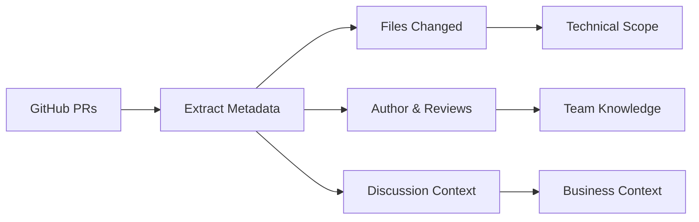

## What is Institutional Memory?

Institutional memory refers to the accumulated knowledge, experiences, and context that an organization or team builds over time. In software development, this includes understanding:

- **Why** decisions were made
- **How** problems were solved  
- **What** approaches were tried and failed
- **When** changes were implemented and by whom

<Info>
Traditional development tools focus on the *current state* of code. ylog focuses on the *evolution* and *reasoning* behind code changes.
</Info>

## The Problem with Lost Context

Without institutional memory, development teams face several challenges:

<AccordionGroup>
  <Accordion title="New Developer Onboarding">
    New team members struggle to understand:
    - Why certain architectural decisions were made
    - The history behind complex code sections
    - Previous attempts to solve similar problems
    - The business context behind technical choices
  </Accordion>

  <Accordion title="Code Review Inefficiency">
    Reviewers often lack context about:
    - Recent changes in the affected areas
    - Previous discussions about similar approaches
    - The original motivation for existing code
    - Related changes that might affect the review
  </Accordion>

  <Accordion title="AI Coding Assistant Limitations">
    AI tools work better with context but often only see:
    - Current code state without evolution history
    - File contents without understanding *why* they exist
    - No knowledge of previous attempts or iterations
    - Limited understanding of business requirements
  </Accordion>

  <Accordion title="Debugging Challenges">
    When bugs occur, developers need to understand:
    - What changed recently in the affected areas
    - Why those changes were made
    - Who has context about the problematic code
    - Similar issues that were resolved before
  </Accordion>
</AccordionGroup>

## How ylog Solves This

ylog creates institutional memory by extracting and preserving the "why" behind code changes:

### 1. PR History Mining



ylog processes your entire PR history to understand:
- What files were changed and how
- Who made the changes and when
- Code review discussions and decisions
- Related issues and business requirements

### 2. AI-Powered Summarization

Instead of storing raw PR data, ylog uses AI to extract:

<CardGroup cols={2}>
  <Card title="Business Impact" icon="chart-line">
    Why the change was needed from a business perspective
  </Card>
  <Card title="Technical Changes" icon="code">
    What was modified technically and how it works
  </Card>
  <Card title="Affected Areas" icon="map">
    Which parts of the codebase were impacted
  </Card>
  <Card title="Decision Rationale" icon="lightbulb">
    The reasoning behind implementation choices
  </Card>
</CardGroup>

### 3. Contextual Placement

ylog doesn't just store this information centrally - it places context where developers need it:

```
src/
├── auth/
│   ├── login.ts
│   ├── middleware.ts
│   └── .ylog              # ← Context about auth changes
├── api/
│   ├── handlers/
│   │   ├── users.ts
│   │   └── .ylog          # ← Context about API changes  
│   └── routes.ts
└── utils/
    ├── validation.ts
    └── .ylog              # ← Context about utility changes
```

## Real-World Example

Consider this scenario: A new developer needs to modify the authentication system.

**Without ylog:**
- Reads current auth code 
- Guesses at the intended behavior
- Might miss edge cases or break existing functionality
- No context about previous auth-related issues

**With ylog:**
- Opens `src/auth/.ylog` to see recent changes
- Understands why OAuth was added and JWT token refresh was fixed
- Sees that rate limiting was a previous concern
- Knows who to ask for deeper context

The `.ylog` file might contain:

```markdown
# Context: src/auth

## Recent Changes (5 PRs, last 6 months)

### #156: Add OAuth 2.0 support
**2025-05-20** by @alice • `oauth.ts`, `middleware.ts`, `types.ts`

Users needed social login options to reduce friction in sign-up flow. 
Marketing reported 40% drop-off at registration.

**Technical changes:** OAuth flow implementation, token validation, user mapping

### #142: Fix JWT token refresh race condition  
**2025-05-15** by @bob • `jwt.ts`, `middleware.ts`

Token refresh was failing under high load causing user logouts during 
peak traffic. Implemented atomic refresh with Redis locking.

### #128: Add rate limiting to login endpoint
**2025-05-01** by @charlie • `middleware.ts`, `rate-limiter.ts`

Security audit revealed brute force vulnerability. Added exponential 
backoff with IP-based tracking.
```

## Benefits of Institutional Memory

<AccordionGroup>
  <Accordion title="Faster Onboarding">
    New developers can understand code areas by reading context files instead of diving through months of PR history.
  </Accordion>

  <Accordion title="Better Code Reviews">
    Reviewers see relevant context about recent changes and can make more informed decisions.
  </Accordion>

  <Accordion title="Enhanced AI Coding">
    AI assistants get rich context about code evolution, making their suggestions more relevant and informed.
  </Accordion>

  <Accordion title="Reduced Knowledge Silos">
    Information doesn't get trapped with individual developers - it's preserved in discoverable locations.
  </Accordion>

  <Accordion title="Improved Debugging">
    When issues arise, developers can quickly understand what changed recently and why.
  </Accordion>
</AccordionGroup>

## Comparison with Other Approaches

| Approach | Pros | Cons |
|----------|------|------|
| **Git Log** | Built-in, detailed | Raw, overwhelming, no business context |
| **Documentation** | Comprehensive | Becomes stale, disconnected from code |
| **Comments** | Inline context | Limited scope, becomes outdated |
| **Wiki/Confluence** | Rich format | Separate from code, hard to maintain |
| **ylog** | Contextual, AI-summarized, discoverable | Requires setup and AI processing |

## Continuous Institutional Memory

ylog doesn't just create a snapshot - it maintains living institutional memory:

<Steps>
  <Step title="Automatic Updates">
    Every `ylog sync` processes new PRs and updates context files with recent changes.
  </Step>
  <Step title="Evolving Context">
    Context files show recent changes prominently while maintaining historical perspective.
  </Step>
  <Step title="Area-Specific Views">
    Different parts of your codebase get their own context, tailored to their evolution.
  </Step>
  <Step title="Queryable History">
    SQLite database enables complex queries across your entire institutional memory.
  </Step>
</Steps>

<Tip>
Think of ylog as creating a "memory palace" for your codebase - every area has its own room filled with the context developers need to work effectively.
</Tip>